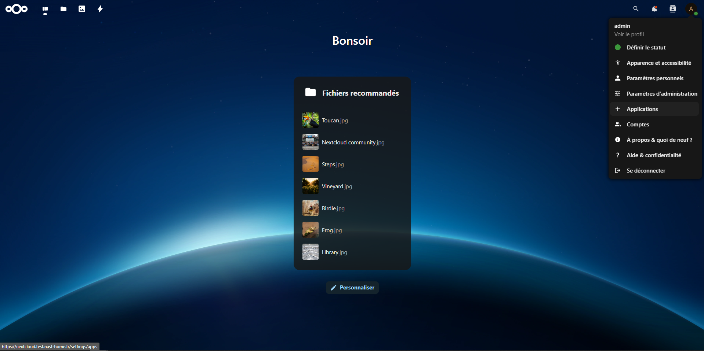

# Stack Nextcloud complète avec OnlyOffice, Nginx Proxy Manager et Let's Encrypt

Cette stack nextcloud complète comprend les services suivants :
- **Nextcloud** : un service de stockage et de partage de fichiers.
- **OnlyOffice** : un éditeur de documents en ligne intégré à Nextcloud.
- **Nginx Proxy Manager** : un gestionnaire de proxy inverse pour gérer les certificats SSL et les redirections.
- **Let's Encrypt** : pour obtenir des certificats SSL gratuits.
- **PostgreSQL** : une base de données pour Nextcloud et OnlyOffice.
- **Redis** : pour la mise en cache et la gestion des sessions.
- **RabbitMQ** : pour la gestion des files d'attente de messages.

>[!NOTE]
>J'ai volontairement modifié certains fichiers de configuration du serveur web de Nextcloud pour corriger divers problèmes de synchronisations et de performances avec des fichiers de grande taille.

## Prérequis

- Docker et Docker Compose installés sur votre machine.
- Un domaine pointant vers votre serveur pour Nginx Proxy Manager.
- Un accès à Internet pour Let's Encrypt.
- *Un serveur SMTP pour nextcloud* (optionnel mais recommandé pour les notifications et la récupération de mot de passe).

## Installation
1. Clonez ce dépôt ou téléchargez les fichiers nécessaires.
   ```bash
   git clone https://github.com/StanislasJEANGEY/nextcloud-onlyoffice-nginxproxymanager-letsencrypt.git
   ```

2. Accédez au répertoire du projet.
   ```bash
    cd nextcloud-onlyoffice-nginxproxymanager-letsencrypt
    ```

3. Modifiez le fichier `.env` pour configurer les variables d'environnement nécessaires, telles que :
   - `DOMAINE` : Votre nom de domaine pour Nginx Proxy Manager.
   - `TZ` : Votre fuseau horaire (par exemple, `Europe/Paris`).
   - `NEXTCLOUD_REDIS_PASSWORD` : Mot de passe pour Redis utilisé par Nextcloud.
   - `NEXTCLOUD_POSTGRES_PASSWORD` : Mot de passe pour PostgreSQL utilisé par Nextcloud.
   - `ONLYOFFICE_POSTGRES_PASSWORD` : Mot de passe pour PostgreSQL utilisé par OnlyOffice.
   - `JWT_SECRET` : Clé secrète pour JWT (JSON Web Token) utilisée par Nextcloud.
   - `RABBITMQ_PASSWORD` : Mot de passe pour RabbitMQ.

>[!NOTE]
>Vous pouvez également modifier les noms d'utilisateur présent dans le fichier `.env`

4. Lancez la stack avec Docker Compose.
   ```bash
   docker compose up -d
   ```

5. Accédez à Nginx Proxy Manager via votre navigateur à l'adresse `http://<votre_domaine>:81` pour configurer les hôtes proxy et les certificats SSL.
   1. Connectez-vous avec les identifiants par défaut :
      - **Email** : `admin@example.com`
      - **Mot de passe** : `changeme`
  
   2. Changez le mot de passe par défaut dès la première connexion.
   
   3. Ajoutez un hôte proxy pour Nextcloud :
      - **Domaine** : `nextcloud.votre_domaine`
      - **Schema** : `https`
      - **Cible** : `nextcloud`
      - **Port** : `443`
      - Activez SSL et choisissez Let's Encrypt pour obtenir un certificat SSL.
      - Cochez les options suivantes :
        - [x] Force SSL
        - [x] HTTP/2 Support
        - [x] HSTS Enabled
        - [x] HSTS Subdomains
    - Dans la section "*Advanced*", ajoutez les en-têtes suivants :
        ```
        proxy_read_timeout 86400s;
        client_max_body_size 0;
        fastcgi_read_timeout 1200;
        proxy_hide_header Upgrade;

        proxy_connect_timeout 3600s;
        proxy_send_timeout 3600s;
        send_timeout 3600s;
        proxy_buffering off;
        ```

    1. Ajoutez un hôte proxy pour OnlyOffice :
        - **Domaine** : `onlyoffice.votre_domaine`
        - **Schema** : `http`
        - **Cible** : `onlyoffice`
        - **Port** : `80`
        - Activez SSL et choisissez Let's Encrypt pour obtenir un certificat SSL.
        - Cochez les options suivantes :
          - [x] Force SSL
          - [x] HTTP/2 Support
          - [x] HSTS Enabled
          - [x] HSTS Subdomains
          
6. Accédez à Nextcloud via votre navigateur à l'adresse `https://nextcloud.votre_domaine` pour terminer la configuration.
   1. Suivez les instructions à l'écran pour configurer le compte administrateur et la base de données
   
   2. Utilisez les informations de connexion PostgreSQL définies dans le fichier `.env`.   
   

   3. Patientez pendant que Nextcloud configure la base de données et les services.

7. Installez l'application OnlyOffice dans Nextcloud :
   1. Allez dans **Applications** dans le menu de Nextcloud.
   

   2. Recherchez et installez l'application **OnlyOffice**.
   

   3. Configurez l'URL du serveur et la paramètres avancés dans les paramètres de l'application ONLYOFFICE.
        - URL du serveur : `https://onlyoffice.votre_domaine`
        - Clé secrète JWT : Utilisez la valeur de `JWT_SECRET` définie dans le fichier `.env`.
        - Dans les paramètres avancés, assurez-vous que les options suivantes sont activées :
          - Adresse du ONLYOFFICE Docs pour les demandes internes du serveur : `https://onlyoffice.votre_domaine`
          - Adresse du serveur pour les demandes internes du ONLYOFFICE Docs : `https://nextcloud.votre_domaine`
    
        

    4. Enregistrez les paramètres
   
8.  Rendez-vous dans le terminal de votre serveur pour modifier le fichier de configuration de Nextcloud :
    ```bash
    nano nextcloud/config/www/nextcloud/config/config.php
    ```
    Ajoutez les lignes suivantes dans le tableau de configuration :
    ```php
    'maintenance_window_start' => 1,
    'default_phone_region' => '<phone_region>',
    'memcache.local' => '\\OC\\Memcache\\Redis',
    'memcache.locking' => '\\OC\\Memcache\\Redis',
    'trusted_proxies' => ['172.18.0.2'],
    'overwrite.cli.url' => 'https://nextcloud.votre_domaine',
    'overwriteprotocol' => 'https',
    'overwritehost' => 'nextcloud.votre_domaine',
    'enable_previews' => true,
    'enabledPreviewProviders' =>
    array (
    'OC\Preview\PNG',
    'OC\Preview\JPEG',
    'OC\Preview\GIF',
    'OC\Preview\BMP',
    'OC\Preview\XBitmap',
    'OC\Preview\MP3',
    'OC\Preview\TXT',
    'OC\Preview\MarkDown',
    'OC\Preview\OpenDocument',
    'OC\Preview\Krita',
    'OC\Preview\HEIC',
    ),
        'redis' => [
        'host' => 'redis-nextcloud',
        'port' => 6379,
        'timeout' => 0.0,
        'read_timeout' => 0.0,
        'password' => '<password>',
    ],
    ``` 
    - Remplacez `<password>` par le mot de passe défini dans le fichier `.env` pour `NEXTCLOUD_REDIS_PASSWORD`.
    - Remplacez `<phone_region>` par votre région téléphonique (par exemple, `FR` pour la France).
    - Sauvegardez et quittez l'éditeur.
   >[!WARNING]
   >Par défaut, l'adresse ipv4 du reverse proxy est défini sur 172.18.0.2  
   >Si cette adresse n'est pas disponible, pensez à la changer dans le docker compose et dans le fichier de configuration de nextcloud > `trusted_proxies`
   
9. Configurer votre serveur SMTP pour Nextcloud : (optionnel mais recommandé)  
    1. Allez dans **Paramètres d'administration** > **Paramètre de base**.  
    2. Configurez les paramètres SMTP avec les informations de votre serveur de messagerie.  
    3. Testez la configuration en envoyant un e-mail de test.  
10. Redémarrez les services Docker pour appliquer les modifications :
    ```bash
    docker compose restart
    ```

## Maintenance :

Si dans la vue d'ensemble de Nextcloud, il est indiqué que vous devez exécuter certaines commandes, voici ce qu'il faut mettre au début de chacune d'elles :
```bash
# se placer dans le répertoire à côte du fichier docker-compose.yml
cd .../nextcloud-onlyoffice-nginxproxymanager-letsencrypt
docker compose exec nextcloud ...
``` 
Exemple :  


```bash
docker compose exec nextcloud occ maintenance:repair --include-expensive
```
